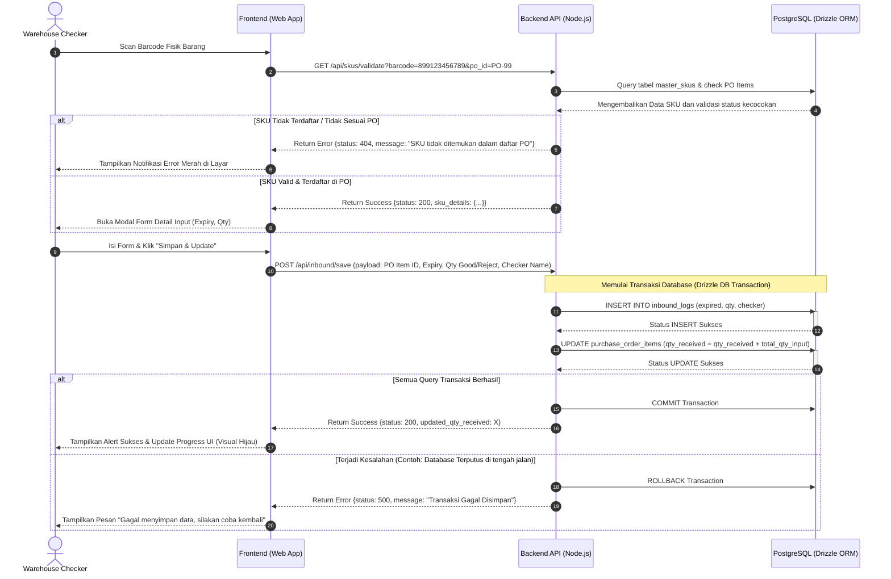
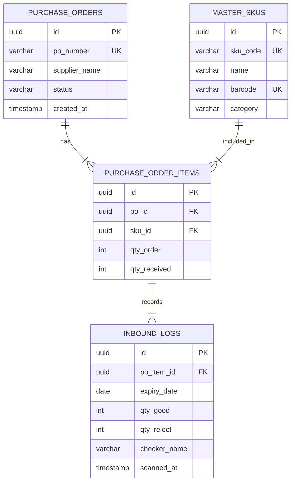

# PRD — Project Requirements Document

## 1. Overview
Proyek ini bertujuan untuk membangun **Inbound Warehouse Scanner**, sebuah aplikasi web responsif (*mobile-first*) yang dirancang khusus untuk tim operasional gudang (Checker) guna memproses penerimaan barang FMCG (Fast-Moving Consumer Goods). Mengingat sifat industri FMCG yang memiliki masa kedaluwarsa ketat—seperti susu bayi dan popok—aplikasi ini berfokus pada akurasi pencatatan data kedaluwarsa (*expiry date*) serta kuantitas barang secara real-time langsung dari area bongkar muat (*receiving dock*).

### Visi Produk
Menjadi alat bantu digital yang cepat, akurat, dan andal untuk menghilangkan kesalahan input manual, mempercepat proses verifikasi barang masuk, dan memastikan kepatuhan pelacakan tanggal kedaluwarsa produk sensitif di gudang.

### Tujuan Bisnis Utama
- **Meningkatkan Akurasi Data**: Menghilangkan kesalahan pencatatan tanggal kedaluwarsa produk FMCG sensitif hingga mendekati 0%.
- **Efisiensi Waktu Inbound**: Mempercepat proses verifikasi barang dari kontainer/truk ke rak penyimpanan sebesar 40% dibanding metode pencatatan kertas atau input manual PC.
- **Transparansi Stok**: Menyediakan pembaruan status pemenuhan Purchase Order (PO) secara instan untuk tim Procurement dan Inventory Control.

### Target Pengguna (User Personas)
*   **Warehouse Checker (Tim Inbound)**: Staf lapangan yang bertugas membuka kontainer, menghitung fisik barang, memindai barcode menggunakan tablet atau perangkat hand-held (PDA), dan menginput detail kondisi fisik barang.
*   **Inbound Supervisor**: Memantau progress penerimaan barang dari seluruh PO yang sedang berjalan di hari tersebut dan menyetujui rekonsiliasi data jika terjadi selisih.

### Masalah yang Ingin Dipecahkan
- **Kesalahan Pencatatan Tanggal Kedaluwarsa**: Produk susu bayi yang mendekati masa kedaluwarsa sering kali lolos karena checker salah mencatat tanggal secara manual pada kertas log.
- **Selisih Stok (Discrepancy)**: Sering terjadi perbedaan antara barang yang dipesan (Qty Order) dengan barang aktual yang diterima tanpa pelacakan detail kondisi (berapa yang dalam kondisi baik vs rusak/reject).
- **Proses Rekonsiliasi Lambat**: Tim admin harus memindahkan data dari kertas log ke sistem ERP secara manual di akhir hari, menyebabkan keterlambatan update stok global.

---

## 2. Requirements

### Functional Requirements

| ID | Deskripsi Kebutuhan |
| :--- | :--- |
| **FR-01** | Sistem harus memungkinkan Checker untuk menginput atau memindai nomor Purchase Order (PO) untuk memulai proses inbound. |
| **FR-02** | Sistem harus menampilkan detail informasi PO beserta daftar item SKU, target Qty Order, dan realisasi Qty Received saat ini. |
| **FR-03** | Sistem harus dapat mengakses kamera perangkat atau scanner hardware terintegrasi untuk memindai barcode standar industri (EAN-13, UPC, Code 128). |
| **FR-04** | Sistem harus memvalidasi apakah barcode yang di-scan terdaftar di database Master SKU dan termasuk dalam daftar item dari PO yang bersangkutan. |
| **FR-05** | Sistem wajib menyediakan form input detail barang setelah scan sukses, meliputi: Expiry Date, Qty Good (Layak), Qty Reject (Rusak), dan Nama Checker. |
| **FR-06** | Sistem harus memperbarui status visual progres penerimaan item PO secara real-time (contoh: menampilkan indikator visual progres seperti *progress bar* dari 0/50 menjadi 50/50). |
| **FR-07** | Sistem harus menerapkan Database Transaction (ACID) saat penyimpanan formulir detail guna menjamin konsistensi data antara log transaksi (`inbound_logs`) dan pembaruan jumlah kumulatif item PO (`purchase_order_items`). |

### Non-Functional Requirements

| Kategori | Deskripsi Kebutuhan | Target/Parameter |
| :--- | :--- | :--- |
| **Performance** | Kecepatan respons aplikasi web saat memvalidasi barcode yang di-scan. | < 500 ms di jaringan 4G standar. |
| | Waktu muat halaman daftar item PO pertama kali. | < 2.0 detik. |
| **Security** | Autentikasi pengguna untuk memastikan hanya checker terdaftar yang dapat menginput data. | JWT atau Session Cookie dengan HTTPS enkripsi penuh. |
| | Validasi data input sisi server (server-side validation). | Mencegah injeksi SQL dan menjamin tipe data valid sebelum masuk DB. |
| **Reliability** | Kemampuan penanganan kegagalan transaksi database (Database Transaction Integrity). | Mekanisme otomatis rollback jika salah satu query gagal (Atomic). |
| **Scalability** | Kemampuan menangani request pemindaian bersamaan oleh banyak checker di lapangan. | Mendukung hingga 100 concurrent scanner tanpa penurunan performa sistem. |
| **Usability** | Desain antarmuka pengguna yang ramah perangkat seluler (*mobile-first design*). | Layout tombol besar, kontras tinggi, mudah ditekan dengan satu tangan oleh pekerja gudang. |

---

## 3. Core Features

| ID Fitur | Nama Fitur | Deskripsi Fitur | Prioritas | Estimasi Kompleksitas |
| :--- | :--- | :--- | :--- | :--- |
| **F-01** | **PO Lookup & Validation** | Modul pencarian nomor PO dengan validasi status PO aktif untuk mencegah pengerjaan ulang PO yang sudah selesai. | High | Low |
| **F-02** | **Dynamic PO Progress Dashboard** | Dashboard interaktif yang menampilkan daftar barang, target order, status realisasi saat ini, dan status visual (Belum Mulai, Kurang, Sesuai, Berlebih). | High | Medium |
| **F-03** | **Integrated Barcode Scanner** | Modul pemindai kamera bawaan berbasis browser (*HTML5 Scanner*) yang responsif terhadap barcode fisik produk. | High | High |
| **F-04** | **Inbound Detail Form Validator** | Form penginputan data Date Picker untuk Expiry Date, pembagian Qty (Good/Reject), serta penamaan Checker yang memproses. | High | Medium |
| **F-05** | **Atomic Save & Log Writer** | Logika backend berbasis database transaction untuk menyimpan log transaksi inbound dan secara otomatis mengupdate pencapaian Qty received pada baris PO terkait. | High | High |

---

## 4. User Flow

Berikut adalah detail alur perjalanan pengguna (Checker) dari awal masuk gudang hingga barang selesai diverifikasi dan disimpan ke sistem:

1.  **Akses Aplikasi & Login**: Checker membuka URL web app melalui peramban (browser) di tablet atau perangkat genggam industri mereka, kemudian memasukkan kredensial login.
2.  **Input Kode PO**: 
    *   Checker tiba di area bongkar muat dan melihat dokumen fisik jalan dari kurir.
    *   Checker mengetikkan atau memindai nomor PO pada kolom pencarian utama.
3.  **Memuat Daftar Item PO**: 
    *   Sistem memverifikasi nomor PO.
    *   Jika valid, sistem akan menampilkan halaman daftar detail PO yang berisi informasi daftar SKU produk, nama produk, Qty Order (misal: 100 unit), dan Qty Received saat ini (misal: 0 unit).
4.  **Proses Pemindaian Produk (Scan Barcode)**:
    *   Checker menekan tombol "Scan" di samping item barang atau mengaktifkan tombol pemindai universal pada layar.
    *   Checker mengarahkan kamera perangkat ke barcode fisik produk susu bayi atau popok yang diterima.
    *   Sistem memvalidasi barcode dengan data Master SKU.
    *   Jika barcode cocok dengan salah satu SKU dalam daftar PO tersebut, sistem menampilkan status sukses dan otomatis membuka jendela *Modal Form Input Detail*. Jika tidak cocok, sistem menampilkan notifikasi kesalahan "SKU Tidak Terdaftar dalam PO Ini".
5.  **Pengisian Detail Inbound**:
    *   Checker memilih **Tanggal Kedaluwarsa** melalui komponen kalender digital (Sistem akan memberi peringatan jika tanggal kurang dari 6 bulan dari hari ini).
    *   Checker memasukkan **Qty Good** (fisik barang dalam kondisi sempurna) dan **Qty Reject** (jika ada barang penyok, basah, atau rusak).
    *   Checker memasukkan **Nama Checker** pelaksana (otomatis terisi dari profil login tetapi dapat disesuaikan).
6.  **Penyimpanan Data (Transaction Commit)**:
    *   Checker menekan tombol "Simpan & Update".
    *   Sistem mengirimkan payload data ke server. Di sisi backend, sistem menjalankan transaksi database terisolasi untuk menyimpan histori ke tabel `inbound_logs` dan mengupdate total `qty_received` pada tabel item PO.
7.  **Pembaruan Visual & Penyelesaian**:
    *   Halaman aplikasi memutakhirkan tampilan visual progres secara instan.
    *   *Progress Tracker* untuk barang tersebut berubah warna menjadi hijau jika kuantitas barang masuk telah terpenuhi sesuai target order (contoh visual: `50/50` dengan indikator centang hijau).
    *   Checker dapat melanjutkan proses pemindaian untuk produk berikutnya dalam daftar PO tersebut hingga semua barang selesai di-inbound.

---

## 5. Architecture

Aplikasi "Inbound Warehouse Scanner" menggunakan arsitektur **Client-Server** monolitik modern atau decoupled yang dioptimalkan untuk performa tinggi pada perangkat seluler.

### Tinjauan Arsitektur
*   **Presentation Layer (Client Side)**: Berupa Single Page Application (SPA) atau framework Hybrid SSR/CSR yang responsif, dirancang dengan konsep *Offline-Ready UI* agar antarmuka tidak membeku ketika koneksi Wi-Fi gudang tidak stabil.
*   **Application Layer (Server Side)**: RESTful API Node.js yang bertugas menerima payload, memvalidasi aturan bisnis (seperti pengecekan tanggal kedaluwarsa minimum), dan mengelola transaksi database melalui Object-Relational Mapping (ORM).
*   **Persistence Layer (Database)**: Relational Database PostgreSQL yang andal dalam menjaga konsistensi ACID (*Atomicity, Consistency, Isolation, Durability*) untuk transaksi inventaris kritis.

```
+--------------------------------------------------------------+
|                Presentation Layer (Frontend Mobile-First)     |
|   - PWA / React SPA (TailwindCSS)                           |
|   - HTML5 Barcode Reader (Camera & Hardware Input)          |
+--------------------------------------------------------------+
                               | (HTTPS / REST API)
                               v
+--------------------------------------------------------------+
|                Application Layer (Backend API)               |
|   - Node.js Runtime                                          |
|   - Drizzle ORM (Type-Safe Query Builder)                    |
+--------------------------------------------------------------+
                               | (Postgres Connection Pool)
                               v
+--------------------------------------------------------------+
|                 Persistence Layer (Database)                 |
|   - PostgreSQL (Relational Database)                         |
|   - Acid Compliance Transactions                             |
+--------------------------------------------------------------+
```

---

## 6. Sequence Diagram

Sequence diagram di bawah ini menjelaskan alur interaksi terperinci saat proses pemindaian barcode barang masuk hingga penyimpanan transaksi selesai menggunakan mekanisme rollback apabila terjadi kegagalan sistem.



---

## 7. Database Schema

Desain basis data dirancang untuk menjaga integritas relasional penuh. Di bawah ini adalah struktur tabel fisik dan diagram hubungan entitas (ERD).

### Desain Tabel Relasional

#### 1. Tabel: `master_skus`
Menyimpan semua katalog produk global yang diakui oleh sistem perusahaan.
*   `id`: UUID (Primary Key)
*   `sku_code`: VARCHAR(50) (Unique, Index) - Kode unik internal SKU.
*   `name`: VARCHAR(255) - Nama barang (contoh: "Susu Bayi Formula S-26 400g").
*   `barcode`: VARCHAR(100) (Unique, Index) - Nomor barcode EAN-13/UPC produk.
*   `category`: VARCHAR(100) - Kategori produk (contoh: "Susu Bayi", "Popok").

#### 2. Tabel: `purchase_orders`
Menyimpan data kepala surat perintah pembelian barang.
*   `id`: UUID (Primary Key)
*   `po_number`: VARCHAR(100) (Unique, Index) - Kode PO transaksi pembelian.
*   `supplier_name`: VARCHAR(255) - Nama pemasok barang.
*   `status`: VARCHAR(50) - Status PO ("PENDING", "PARTIAL", "COMPLETED").
*   `created_at`: TIMESTAMP - Tanggal pembuatan dokumen PO.

#### 3. Tabel: `purchase_order_items`
Tabel jembatan yang merinci barang apa saja dan berapa jumlah yang dipesan dalam satu PO.
*   `id`: UUID (Primary Key)
*   `po_id`: UUID (Foreign Key references `purchase_orders.id` ON DELETE CASCADE)
*   `sku_id`: UUID (Foreign Key references `master_skus.id` ON DELETE RESTRICT)
*   `qty_order`: INT - Jumlah barang yang dipesan.
*   `qty_received`: INT (Default: 0) - Jumlah total barang yang telah berhasil diterima.

#### 4. Tabel: `inbound_logs`
Mencatat sejarah transaksi pengetokan barang masuk secara mendetail per kedaluwarsa.
*   `id`: UUID (Primary Key)
*   `po_item_id`: UUID (Foreign Key references `purchase_order_items.id` ON DELETE RESTRICT)
*   `expiry_date`: DATE - Tanggal masa kedaluwarsa barang.
*   `qty_good`: INT - Jumlah barang layak simpan.
*   `qty_reject`: INT - Jumlah barang rusak/ditolak.
*   `checker_name`: VARCHAR(150) - Nama checker yang melakukan pengerjaan transaksi ini.
*   `scanned_at`: TIMESTAMP (Default: NOW()) - Waktu pencatatan sistem.

### Entity Relationship Diagram (ERD)



---

## 8. Tech Stack

Untuk merealisasikan aplikasi "Inbound Warehouse Scanner" dengan performa tinggi, berikut adalah rekomendasi tumpukan teknologi (tech stack) yang harus digunakan:

### Frontend (Client-side)
*   **Framework**: **Next.js (React)** atau **React SPA (Vite)** untuk performa inisiasi aplikasi yang cepat di perangkat seluler dengan keterbatasan memori.
*   **Styling**: **TailwindCSS** untuk pembuatan komponen responsif dan ramah sentuhan jemari (*UI elements size min 48px*).
*   **Library Barcode Scanner**: **Html5-qrcode** atau SDK internal bawaan perangkat pemindai (Zebra DataWedge API via WebIntent/REST API) guna mendukung performa pemindaian yang cepat dan andal menggunakan kamera internal.

### Backend (Server-side)
*   **Runtime Environment**: **Node.js** (dengan TypeScript untuk pengetikan statis guna meminimalkan kesalahan penulisan skrip).
*   **Framework**: **Fastify** atau **Express.js** untuk penanganan routing API yang cepat dan ringan.
*   **ORM**: **Drizzle ORM** (untuk koneksi ke PostgreSQL dengan performa tinggi, dukungan penuh type-safe query, serta kemudahan dalam mengeksekusi operasi transaksi relasional kompleks).

### Database
*   **Database Engine**: **PostgreSQL (v14 atau versi terbaru)** karena mendukung pemrosesan relasional yang kuat, handal dalam skenario konkurensi data yang tinggi, dan kepatuhan transaksi ACID penuh.

### Hosting & Infrastructure
*   **Cloud Platform / Hosting**: **Vercel** (untuk frontend Next.js) dan **Render** / **Railway** atau **AWS ECS** (untuk penampungan backend & database PostgreSQL).
*   **Connection Pooler**: **PgBouncer** (direkomendasikan jika skalabilitas koneksi dari serverless function melonjak tinggi saat banyak checker beroperasi bersamaan).

### Integrasi Pihak Ketiga & Perkakas Lainnya
*   **Sistem Log**: **Winston** atau **Pino Logger** di backend untuk pelacakan error transaksi internal sistem.
*   **Pemberitahuan Instan (Opsional)**: **Pusher** atau **Socket.io** jika supervisor membutuhkan tampilan dashboard real-time yang memantau pergerakan kerja checker secara nirkabel dari kantor utama.